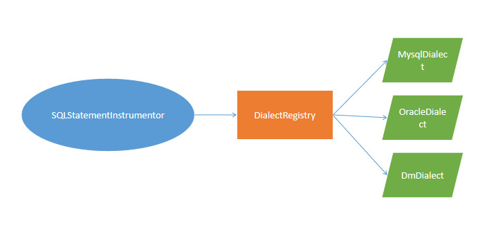

## How to Integration {#pagination_how_to_integration}

+ **Dialect** is a core class, use it, you can parseURL, set limit, offset for a pagination request, escape the like parameters, generate table's DDL etc. Every database will has a dialect.
+ **DialectRegistry** is the dialect registry centeral
+ **LikeEscaper** use it to avoid some keywords (%, _ ...) in like clause
+ **UrlParser** parse jdbc url
+ **SQLStatementInstrumentor** instrument some string to a sepicified Sql statement
+ **Pagination** common pagination, will be used in mybatis, spring-jdbc, apacha commons-dbutils, mango, ebean, jfinal ...
+ **ResultSetExtractor** the resultset extractor, extract a result to any you expected. so you can use in any jdbc framework
+ **BatchUpdater** supply 3 batch update mode: 
  + BATCH_SQL: use database's batch sql
  + JDBC_BATCH: use jdbc batch operation
  + SIMPLE: just insert or update in a for loop
+ **ConnectionManager** support custom connection configuration, datasource ...
+ **BatchInsertExecutor** batch insert a large dataset to database
+ **SqlFormatter** format a sql
+ **TableGenerator** a table DDL generator
+ **TableDDLDumper** dump the ddl of any table

